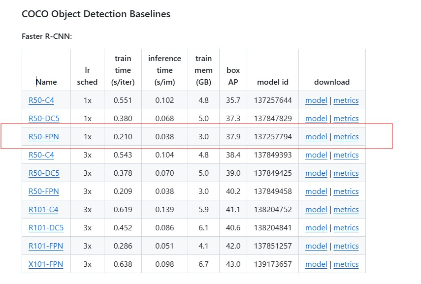

# Project advanced AI

## Object detection

Train an object detection model capable of detecting the current board setup for a chess.com game. Select a model and train it using relevant chess images. The model should be able to detect all the pieces together with their color in various settings. Test the model on images that you made yourself and demonstrate that it works correctly. Check how good it performs on other images, not from chess.com. Don’t forget to do data analysis on your dataset.

### existing models
I found a few models on chess.com images on [roboflow](https://universe.roboflow.com). 
I selected the model with the highest precision and recall: https://universe.roboflow.com/grupo-12/grupo12-fzbt4 . I couldn't find a way to use this model locally. It was possible to download the dataset in COCO format.
Maybe look into the huggingface model a bit more?
### training
Selection of the model:
------------------------
Out of the model zoo (detectron) [Detectron model zoo](https://github.com/facebookresearch/detectron2/blob/main/MODEL_ZOO.md) we can select a quite basic model since we only need to detect simple symbols/figures. Bounding boxes are sufficient since we need only to detect location and type in a certain grid.
The grid of a picture can be detected by toolbox of OpenCV, so no AI model needed to do this (keep it simple).
Once grid is determined and image size is rescaled the type of figures can be deterministic positioned on the chess board. Therefore since this is 8x8 matrix a bounding box to determine the position is sufficient.
Therefore we choose a simple instance model (no mask, no polygon,…)
We select a pretrained low memory, fast train and fast inference model since the task is simple.

Similar to the training on chickens, didn't change any parameters, no image augmentation etc

### test on images that you made yourself
in data/browserscreenshots there are some screenshots I made myself on chess.com. I added some code to extract only the chessboard in the notebook, output was stored in data/chessboards.

TO DO:

-	Data analyse 
o	Distributie van de figuren  -> gelijk verdeeld voor speciale figuren (loper, toren,..)
o	Distributie van elke figuur op het bord met kans op voorkomen
-	Extra dataset en trachten het model verder te trainen, te verbeteren met andere vormen, andere kleuren. (elk apart – wachten tot Q&A)
-	Validatie-set (cvat maken Tom – en delen met Leen)
o	Andere website/app als test set.
o	Labellen CVAT en exporten als COCO formaat.
-	
